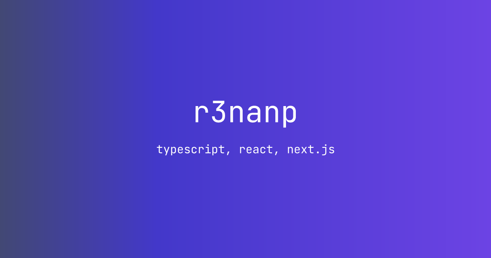

# 👋 Hi, I'm Renan Souza

💻 **Software Engineer | Problem Solver**

I'm a 22-year-old developer from **Fortaleza, Brazil**, passionate about creating **impactful solutions** for modern challenges. My expertise lies in **full-stack development, API design, and performance-driven applications**, but what truly drives me is solving complex problems with **creativity and efficiency**.

Currently, I'm working as a **Software Engineer at [Wedy](https://casamento.wedy.com)**, building solutions that power thousands of social events across Brazil .
Outside of work, I love experimenting with **personal projects** and exploring new **tech stacks, AI tools, and system design patterns**.

---

### 🚀 What I Do

- **Web & Mobile Development** (React, Next.js, React Native)
- **Backend & APIs** (Node.js, TypeScript, Prisma, PostgreSQL)
- **Serverless & Cloud** (Vercel, AWS, Edge Functions)
- **AI Integrations** (LangChain, OpenAI API)

---

### 🌍 Let's Connect

- 🤵 Because "you have to" <a href="https://linkedin.com/in/r3nanp">Linkedin</a>
- 📸 Posting pictures on <a href="https://instagram.com/r3nanp_">Instagram</a>

  

